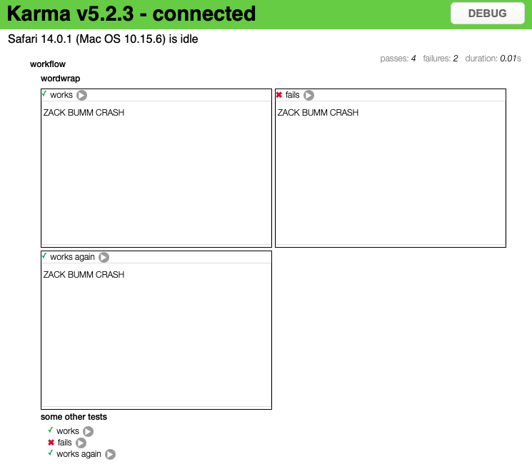

# karma-mocha-html-annotations-reporter

A Karma+Mocha HTML reporter with HTML annotations.

karma-mocha-html-annotations-reporter is currently being written to develop <a
href="https://github.com/markandre13/workflow">workflow</a>.

Since workflow has a lot of graphic algorithms which need to be covered by tests and whose purpose is hard to put into words or ascii art, this reporter provides an <em>annotate</em> function to add HTML to the test description and a reporter to render the result in Karma's server page.

## How does it look like

## Usage

* add <em>karma-mocha-html-annotations-reporter</em> to your karma.conf.* reporters
* when using typescript add: <code>import {annotate} from "karma-mocha-html-annotations-reporter"</code>
* use the <em>annotate</em> function to add html annotations to your test report
<pre>
describe("workflow", function() {
    describe("wordwrap", function() {
        it("works", function() {
            let svg = document.createElementNS("http://www.w3.org/2000/svg", "svg")
            ...
            annotate(this, svg)
        })
    })
})

</pre>
